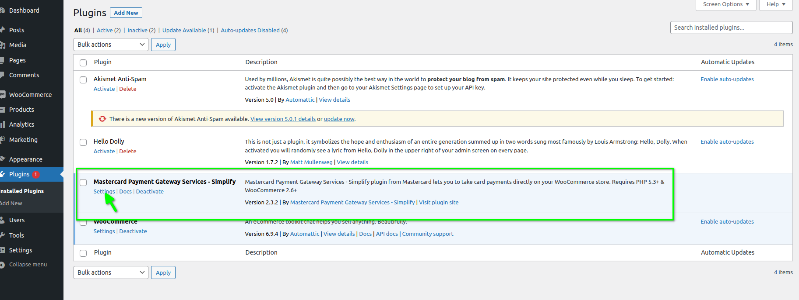
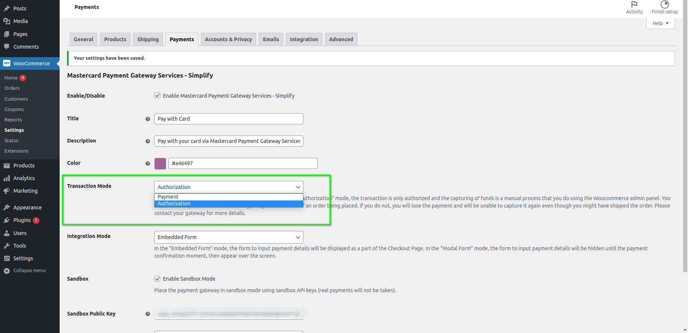
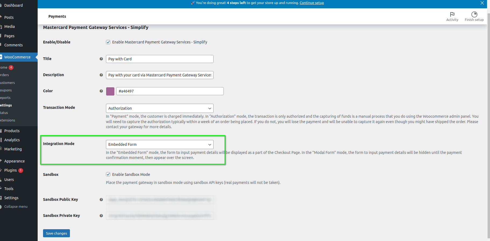
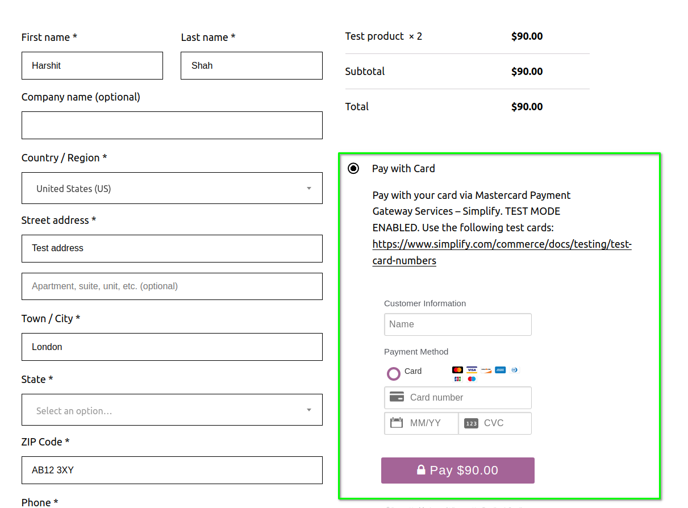
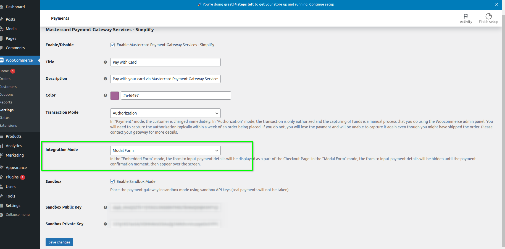
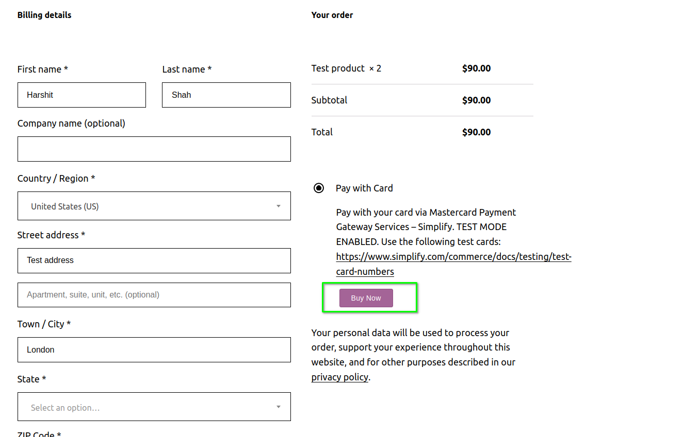
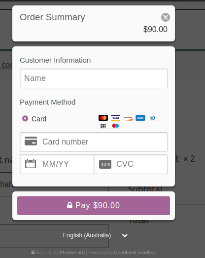

# Simplify Commerce Payment Gateway for WooCommerce

The Simplify Commerce payment gateway plugin for WooCommerce 3.6+ lets you to take card payments directly on your WooCommerce store.

The Standard payment form in some of the previous releases is now deprecated and out of support.

## Support

For any issues or enhancement requests you have with this plugin, please raise them with the bank's support team. Please make sure you also provide your plugin, woocommerce and wordpress version as well as your merchant ID where applicable. This will help to speed up the troubleshooting of any issues you are having.

## Getting Started 

* Get your API keys from your merchant dashboard in your Account Settings - API Keys.
* Follow the plugin installation instructions below 
* You're ready to take payments in your WooCommerce store!

## Installation

**Minimum Requirements**

* WooCommerce 3.9.2 or greater
* PHP version 5.3 or greater
* cURL

The module has been tested and is supported with the following versions of WooCommerce:
3.9.2 - 5.8.0

### Steps 
1. Download the latest plugin zip file from [this link](https://github.com/simplifycom/woocommerce-simplify-payment-gateway-plugin/releases/latest).

2. Add New Plugin
   
   
3. Upload zip file
  
   
4. Activate Plugin
   
   
5. Plugin Settings 
   

6. Select Transaction Mode
  

    There are two Transaction Modes:
    
  - Authorization: In "Authorization" mode, the transaction is only authorized, and the capturing of funds is a manual process that you do use the Woocommerce admin panel. 
  - Payment: The customer is charged immediately in "Payment" mode.

7. Select Integration Mode

    There are two Integration Modes:

  - Embedded Form: The card detail form will appear on the checkout page below the payment method in this integration mode. So user can directly enter their card detail on the checkout page and place an order. 
  
    

  - Modal Form: In this integration mode, the form to input payment detail will appear as a popup. On the checkout page, the Buy Now button will be available, and once the user clicks on Buy now button, a popup will appear where the user can enter their payment detail.
  
    
      

6. Enter API Keys and other settings
   
   

## Why choose Simplify Commerce?

With Simplify Commerce, you can easily integrate online payments from most major card brands and start selling right away. Our powerful dashboard and features, including e-invoices and recurring payments, make it easy to immediately meet your needs.

Choose Simplify Commerce as your WooCommerce payment gateway to get access to your money quickly with a powerful, secured payment engine supplied by Mastercard.

## Frequently Asked Questions

### Does this support recurring payments, like for subscriptions?
Yes!

### Does this support both production mode and sandbox mode for testing?
Yes it does - production and sandbox mode is driven by the API keys you use.

### License
This software is Open Source, released under the Apache License 2.0. See [LICENSE.txt](LICENSE.txt) for more info.
