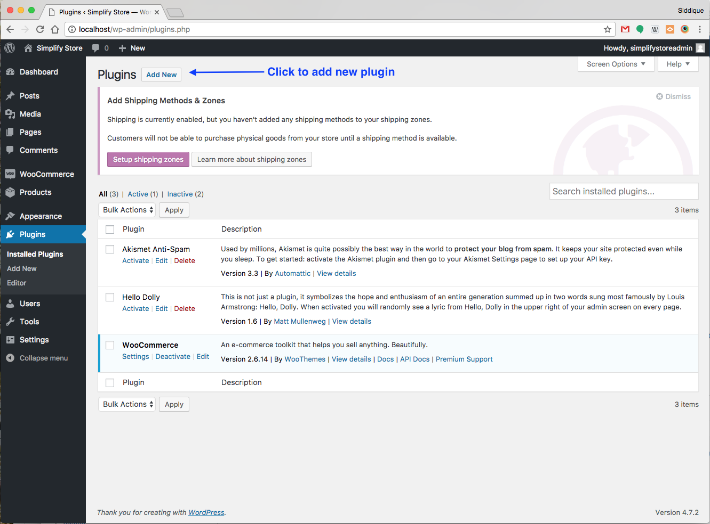
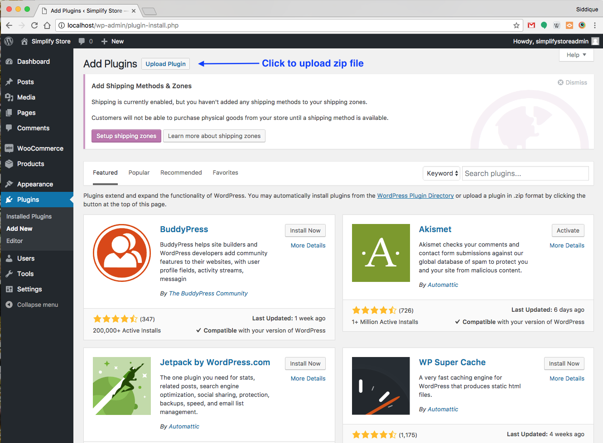
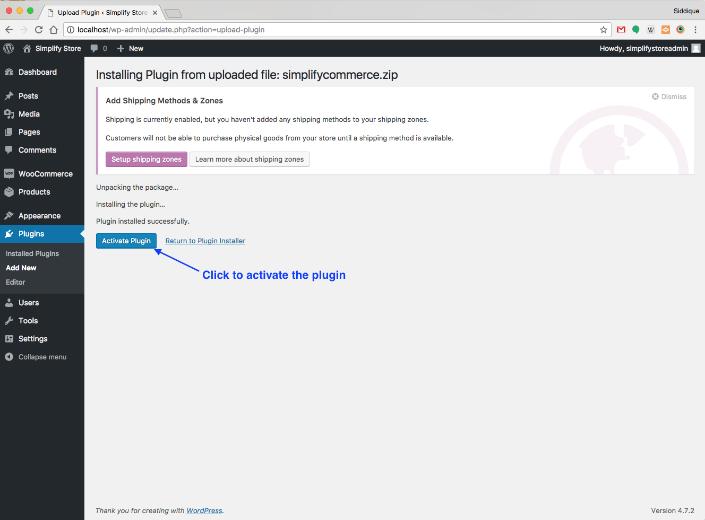
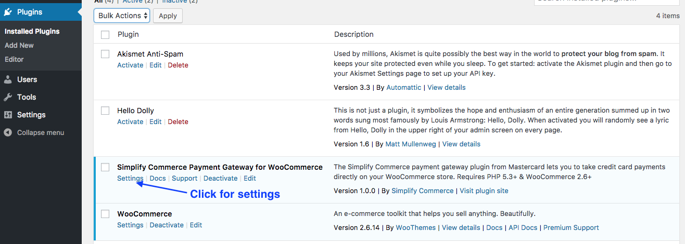
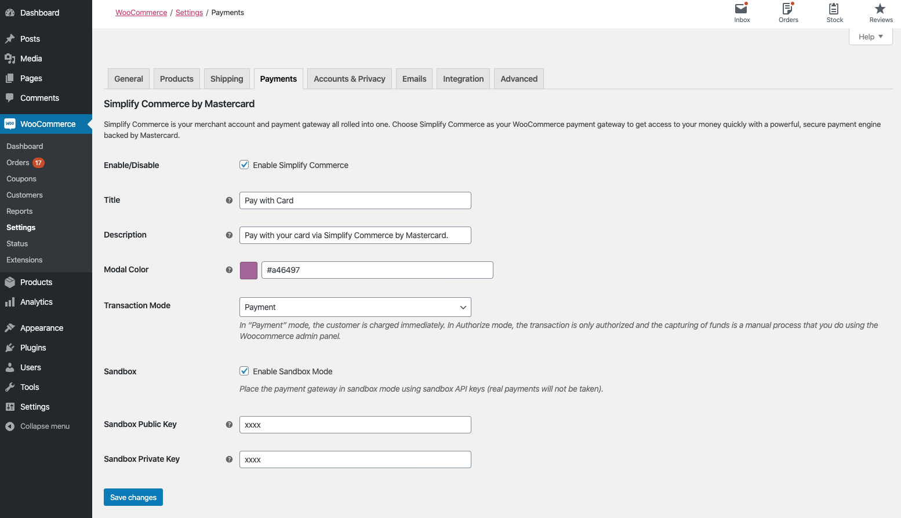

# Simplify Commerce Payment Gateway for WooCommerce

The Simplify Commerce payment gateway plugin for WooCommerce 2.6+ lets you to take credit card payments directly on your WooCommerce store.

## Getting Started 

* Sign up and confirm your Simplify Commerce account [here](https://www.simplify.com/commerce/login/signup).
* Get your API keys from Simplify at [Settings/API Keys](https://www.simplify.com/commerce/login/auth#/account/apiKeys).
* Follow the plugin installation instructions below 
* You're ready to take payments in your WooCommerce store!

## Installation

Please note this plugin requires WooCommerce 2.6 and above. Prior to 2.6, Simplify Commerce was bundled with WooCommerce core.

**Minimum Requirements**

* WordPress 4.4 or greater
* PHP version 5.3 or greater
* cURL

1. Download the plugin zip file from this [link](https://github.com/simplifycom/woocommerce-simplify-payment-gateway-plugin/raw/master/dist/simplifycommerce.zip)

2. Add New Plugin
   
   
3. Upload zip file
   
   
4. Activate Plugin
   
   
5. Plugin Settings 
   
   
6. Enter API Keys and other settings
   
   

## Why choose Simplify Commerce?

With Simplify Commerce, you can easily integrate online payments from most major card brands and start selling right away. Our powerful dashboard and features, including e-invoices and recurring payments, make it easy to immediately meet your needs.
Choose Simplify Commerce as your WooCommerce payment gateway to get access to your money quickly with a powerful, secured payment engine supplied by Mastercard.

* 2.75% + 30¢ simple pricing
* No setup fees.
* No refund costs.
* No monthly service fees (Subject to $10 minimum monthly processing fee).
* Accept Mastercard, Visa, American Express, Discover, JCB and Diners Club transactions
* Enjoy peace of mind from knowing your transactions are secure – all sensitive data is managed by Simplify Commerce

## Frequently Asked Questions

### What countries does this plugin support?
Simplify Commerce currently supported in US and Ireland. We are constantly adding more countries. So, please check back to see if we have the country you are looking for.

### Does this support recurring payments, like for subscriptions?
Yes!

### Does this support both production mode and sandbox mode for testing?
Yes it does - production and sandbox mode is driven by the API keys you use.

### Where can I find documentation, help and support?

For help setting up and configuring, please refer to our [support page](https://simplify.desk.com/customer/en/portal/articles/2639101-woocommerce-installation-guide)

### License
This software is Open Source, released under the BSD 3-Clause license. See [LICENSE.txt](LICENSE.txt) for more info.

